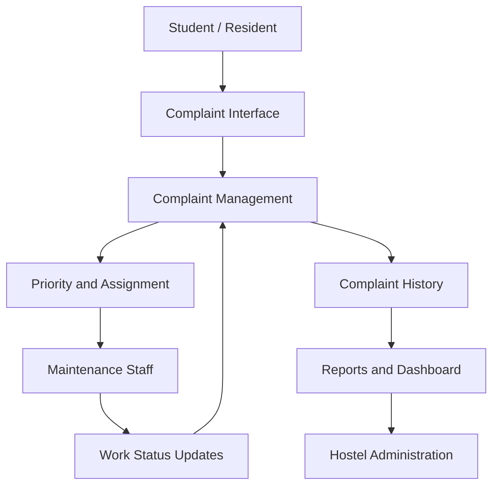

# CASE STUDY: EPTURA ARCHIBUS

## 1. Platform Overview

### 1.1 Platform Name

**Eptura Archibus**

### 1.2 Company

**Eptura**

### 1.3 Domain

**Integrated Workplace and Facilities Management (IWMS)**

Eptura Archibus brings workplace, facility, maintenance, asset, and space information into one system.  
It is used to manage day-to-day operations across built environments. 

### 1.4 Authors

**Killo Lawrence**

---

## 2. Problem Statement

### 2.1 Existing Problem

Our project focuses on **centralized hostel maintenance and complaint management**.

Hostel complaints can involve electrical faults, plumbing, furniture, cleaning, or other maintenance work.  
When reports are scattered across calls, messages, or paper, tracking them becomes difficult.

The system should provide one place to submit, assign, track, and close maintenance complaints.

### 2.2 Target Users

- **Students / Hostel Residents** — submit complaints and check their status.
- **Hostel Administrators / Wardens** — monitor complaints, assign work, and check progress.
- **Maintenance Staff** — handle assigned complaints and update their status.
- **Management** — review maintenance and complaint reports.

### 2.3 Platform's Approach

Archibus provides a useful reference because it brings service requests and maintenance work into a structured workflow.  
Requests can be categorized, prioritized, assigned, tracked, and updated.

Its work-order features also connect assignments, priorities, due dates, assets, and maintenance activities.

For our hostel project, this can be simplified to:

**Student → Complaint → Assignment → Maintenance → Resolution**

---

## 3. Features & Internal Architecture

> **Architecture note:** Eptura does not publicly document every private implementation detail of Archibus.  
> The architecture below therefore focuses on documented workflows rather than guessing internal databases, services, or algorithms.

### 3.1 Centralized Complaint / Service Request Management

#### Purpose

The goal is to give users one place to report maintenance problems and follow their progress.

Archibus supports service requests with categorization, prioritization, routing, assignment, and status tracking.

#### Components

- User request interface
- Service request / complaint record
- Request category
- Location information
- Priority
- Assigned maintenance personnel
- Status tracking
- Notifications / updates
- Completion record

#### Internal Working

```text
Student / User
      ↓
Submit Complaint
      ↓
Select Category + Location + Description
      ↓
Create Complaint Record
      ↓
Prioritize / Route
      ↓
Assign Maintenance Staff
      ↓
Work in Progress
      ↓
Resolve Complaint
      ↓
Close Complaint
```

#### Data Flow

```text
User Complaint
      ↓
Complaint Interface
      ↓
Validation & Categorization
      ↓
Complaint Record
      ↓
Assignment / Workflow
      ↓
Maintenance Staff
      ↓
Status Update
      ↓
Resolution / Closure
```

For the hostel system, a complaint record could contain:

```text
Complaint ID
Student ID
Hostel / Block
Room Number
Complaint Category
Description
Priority
Date Submitted
Assigned Staff
Status
Resolution Details
Date Closed
```

### 3.2 Work Order and Task Management

#### Purpose

A complaint that needs physical work should become a clear task for the responsible maintenance staff.

Archibus work orders can track assignments, priorities, due dates, maintenance activities, assets, parts, and completed work.

#### Components

- Work order
- Assigned technician / maintenance staff
- Priority
- Due date
- Task description
- Required materials
- Work status
- Completion record

#### Internal Working

```text
Complaint
   ↓
Work Order Created
   ↓
Priority Determined
   ↓
Staff Assigned
   ↓
Maintenance Performed
   ↓
Progress Updated
   ↓
Work Completed
   ↓
Complaint Closed
```

#### Data Flow

```text
Complaint Record
      ↓
Work Order
      ↓
Maintenance Staff
      ↓
Work / Repair
      ↓
Progress Update
      ↓
Completion Details
      ↓
Closed Complaint
```

For our project, simple statuses are enough:

```text
Submitted
   ↓
Assigned
   ↓
In Progress
   ↓
Resolved
   ↓
Closed
```

### 3.3 Priority-Based Maintenance

#### Purpose

Not every complaint needs the same response time.  
For example, a water leak may need attention before a minor lighting issue.

Archibus supports prioritization and routing so maintenance work can be organized by urgency.

#### Components

- Complaint priority
- Category
- Location
- Assigned staff
- Due date
- Status

#### Internal Working

```text
High Priority
    ↓
Immediate / Early Assignment

Medium Priority
    ↓
Normal Maintenance Queue

Low Priority
    ↓
Routine Maintenance Queue
```

The hostel administration should define the actual priority rules.

### 3.4 Asset and Maintenance History

#### Purpose

Linking complaints to physical assets makes repeated problems easier to track.

Examples include fans, lights, water systems, doors, furniture, and other hostel equipment.

Archibus includes asset information and maintenance records for buildings, equipment, and infrastructure.

#### Components

- Asset record
- Asset location
- Asset condition
- Maintenance history
- Related complaints
- Maintenance activity

#### Internal Working

```text
Hostel Asset
     ↓
Complaint / Maintenance Request
     ↓
Maintenance Work
     ↓
Maintenance History
     ↓
Future Maintenance Decision
```

A hostel asset could contain:

```text
Asset ID
Asset Name
Hostel Block
Room / Location
Condition
Installation Date
Last Maintenance Date
Related Complaints
```

### 3.5 Mobile / Field Maintenance Workflow

#### Purpose

Maintenance staff often work away from the administration desk.  
Archibus OnSite lets technicians view and update work orders and asset information from mobile devices.

It also supports offline work with later synchronization.

#### Components

- Mobile interface
- Assigned work orders
- Asset information
- Task updates
- Notes / photos
- Synchronization

#### Internal Working

```text
Administrator
     ↓
Assigns Work
     ↓
Maintenance Staff Mobile Interface
     ↓
Views Complaint
     ↓
Performs Work
     ↓
Updates Status
     ↓
System Records Result
```

For a student project, a responsive web interface can provide the same basic workflow without copying the full enterprise mobile system.

### 3.6 Reporting and Maintenance Analytics

#### Purpose

Past complaint data can show recurring problems and help administrators monitor unresolved work.

Eptura provides reporting and analytics around facility operations, work orders, equipment, and related activities.

#### Useful Hostel Reports

- Total complaints
- Pending complaints
- Resolved complaints
- Complaints by hostel block
- Complaints by category
- High-priority complaints
- Average resolution time
- Repeated complaints
- Maintenance workload by staff member

#### Data Flow

```text
Complaint Records
       ↓
Database / Historical Records
       ↓
Report Processing
       ↓
Dashboard
       ↓
Hostel Administrator
```

### 3.7 Overall Architecture

A simple logical architecture for the project is:



The main lesson from Archibus is to connect **requests, people, locations, maintenance work, assets, and history**.  
This is more useful than treating every complaint as a separate message.

---

## 4. Features Applicable to Our Project

### 4.1 Adopt

The following concepts can be used directly at a simpler scale:

| Platform Capability | Relevance | Proposed Use |
|---|---|---|
| Centralized service requests | High | One system for all hostel complaints |
| Complaint / work tracking | High | Students and administrators can see status |
| Assignment | High | Assign complaints to maintenance staff |
| Priority | High | Handle urgent complaints first |
| Maintenance history | High | Keep records of completed work |
| Reporting | High | Show pending, completed, and recurring complaints |

These features match the main ideas in Eptura's service-request and work-order workflows.

### 4.2 Adapt

Some Archibus features should be reduced for a hostel project.

**Enterprise work orders → Simple hostel complaints**

Use a small complaint record with status, priority, assignment, and resolution instead of a complex enterprise work order.

**Facility / asset management → Hostel asset tracking**

Connect complaints to hostel blocks, rooms, and selected assets without building a full enterprise asset-management system.

**Mobile technician workflow → Responsive web interface**

A responsive page can give maintenance staff their assigned complaints and status controls without a separate mobile app.

**Enterprise analytics → Simple dashboard**

Use basic charts and counts for complaints, categories, priorities, and resolution status.

### 4.3 Future Possibilities

- Preventive maintenance scheduling
- Asset lifecycle tracking
- Photo attachments for complaints
- Automated notifications
- Vendor management
- Mobile application
- QR codes for reporting problems by room or asset
- Advanced maintenance analytics
- Integration with hostel administration systems

These features can be considered if the project grows beyond its basic complaint-management workflow.

---

## 5. Limitations, Trade-offs & Lessons

### 5.1 Observed Limitations

Archibus is built for complex workplace and facilities-management environments, not specifically for student hostels.  
Its feature set covers areas such as space, assets, maintenance, service requests, workplace experience, and integrations.

For a small hostel project, copying the full platform would add complexity without necessarily solving the core problem.

Public product information also does not reveal every internal implementation detail.  
Private database structures, services, algorithms, and message-processing mechanisms should therefore not be assumed.

### 5.2 Architectural Lessons

**1. Centralize the complaint lifecycle.**

Keep each complaint traceable from submission through closure.

**2. Separate users from maintenance tasks.**

The person reporting a problem and the person fixing it may have different roles and permissions.

**3. Keep status explicit.**

A simple flow such as `Submitted → Assigned → In Progress → Resolved → Closed` keeps the process clear.

**4. Store history.**

Past complaints help identify repeated problems and maintenance patterns.

**5. Connect location information to complaints.**

For a hostel, the block and room number help staff find the problem quickly.

### 5.3 Things We Should Avoid

The project should not copy enterprise complexity unless the requirement is clear.

- Avoid unnecessary enterprise modules.
- Avoid complicated workflows for simple hostel complaints.
- Avoid storing the same complaint data in multiple places.
- Avoid advanced integrations before the core workflow is stable.
- Avoid designing a large system without clear user roles.

The main lesson is to use the useful Archibus workflow while keeping the hostel system small and focused.

---

## 6. Key Findings

1. **Centralized service requests** fit the hostel complaint problem.
2. **Assignment and prioritization** turn reports into actionable maintenance tasks.
3. **Work-order tracking** records responsibility and completion.
4. **Asset information and history** help identify repeated equipment or location problems.
5. **Mobile field access** helps staff update tasks while working away from the desk.
6. **Reporting and historical data** help administrators understand complaint patterns and workload.
7. The hostel project should use these ideas at an appropriate scale instead of reproducing the full enterprise platform.

---

## 7. Conclusion

Eptura Archibus centralizes facilities, workplace services, assets, maintenance, and related operational information.  
Its service-request and work-order workflows provide a useful reference for our hostel maintenance system.

The most relevant ideas are complaint submission, priority-based assignment, status tracking, maintenance history, and reporting.

The project does not need to reproduce Archibus in full.  
A simpler workflow is enough:

```text
Report Problem
      ↓
Record Complaint
      ↓
Prioritize
      ↓
Assign Staff
      ↓
Perform Maintenance
      ↓
Update Status
      ↓
Close Complaint
      ↓
Keep History & Reports
```

This workflow provides a practical foundation for a hostel maintenance and complaint management system.

---

## 8. References

1. Eptura. **Archibus by Eptura — Facility and Workplace Management Platform.**  
   https://eptura.com/our-platform/archibus/

2. Eptura. **Workplace Experience — Service Requests and Workplace Management.**  
   https://eptura.com/our-platform/archibus/workplace-experience/

3. Eptura. **Employee Service Requests — Request Management Software.**  
   https://eptura.com/our-platform/workplace-experience-software/employee-service-requests/

4. Eptura. **Work Order and Ticketing Management.**  
   https://eptura.com/our-platform/facility-management-software/work-order-and-ticketing-management/

5. Eptura. **Archibus Asset Management.**  
   https://eptura.com/our-platform/archibus/asset-management-bim/

6. Eptura. **Archibus OnSite — Technician Mobile Experience.**  
   https://eptura.com/our-platform/archibus/technician-mobile-experience/

7. Eptura. **Facility Management Software.**  
   https://eptura.com/our-platform/facility-management-software/