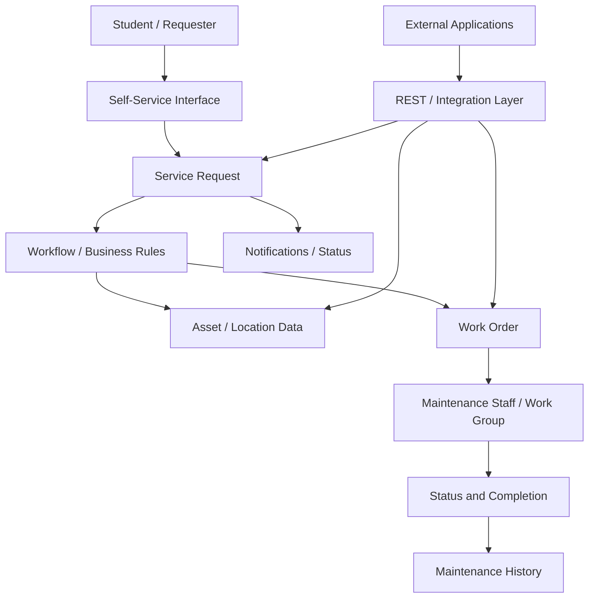

# CASE STUDY: IBM MAXIMO

## 1. Platform Overview

### Platform
**IBM Maximo Application Suite (Maximo)** is an IBM platform for enterprise asset and maintenance management.

### Company
**IBM**

### Domain
Maximo covers asset management, maintenance, reliability, and facilities management. IBM presents it as a central place for managing assets, work, inspections, and maintenance history. [1]

### Authors
Moinuddin

---

## 2. Problem Statement

### Existing Problem
Our project focuses on a **centralized hostel maintenance and complaint management system**.

In a hostel, students may report electrical, plumbing, furniture, water, or room problems through different channels. This makes it harder to assign work, track progress, and keep a clear history.

Maximo solves a similar problem by keeping service requests, work orders, assets, and maintenance history together. Its facilities tools also connect locations, assets, and work orders. [1][2]

### Target Users
The main users are students, hostel administrators, maintenance staff, supervisors, and system administrators.

Students report issues, administrators assign them, and maintenance staff update the work. Supervisors can monitor pending work, while administrators manage users and system settings.

Maximo's service-request model supports both requesters and service agents, with requests assigned to people or work groups. [3]

### Platform Approach
Maximo treats a maintenance issue as a service request linked to an asset or location. The request can be created, assigned, updated, and closed as the work moves forward. [3]

For our hostel project, the flow is simple:

```text
Student reports issue
        ↓
Complaint / Service Request
        ↓
Room or Asset identified
        ↓
Priority and category set
        ↓
Maintenance staff assigned
        ↓
Work completed
        ↓
Status updated
        ↓
Complaint closed
```

---

## 3. Features and Internal Architecture

### 3.1 Service Request / Complaint Management

**Purpose:** Service Request Management gives every complaint a proper record. It supports creating, assigning, updating, escalating, and resolving requests. [3]

For our project, a complaint would store the requester, category, location, priority, assigned staff, status, and resolution details.

**How it works:** A student submits a complaint, and an administrator or agent assigns it to the right person or work group. The record can be updated until the issue is resolved. [3]

```text
Student
   ↓
Complaint Interface
   ↓
Service Request
   ↓
Category + Location + Priority
   ↓
Assignment / Workflow
   ↓
Maintenance Staff
   ↓
Resolution
   ↓
Complaint History
```

### 3.2 Work Order Management

**Purpose:** A service request explains the problem, while a work order represents the actual maintenance work. Maximo supports creating, assigning, tracking, and completing work orders. [4]

A work order can include the location, priority, technician, job plan, status, and completion details.

**How it works:** The complaint is reviewed and given a priority before it is assigned to a maintenance group. The work then moves from in progress to completed and finally closed. [5]

```text
New Complaint
     ↓
Review
     ↓
Priority
     ↓
Assign Staff
     ↓
In Progress
     ↓
Completed
     ↓
Verified / Closed
```

### 3.3 Preventive Maintenance

**Purpose:** Preventive maintenance plans work before something breaks. This can help with regular hostel checks for electrical systems, plumbing, water facilities, and shared equipment.

Maximo can connect a preventive-maintenance record to an asset or location and generate work orders based on a schedule. [6][7]

```text
Maintenance Schedule
       ↓
Preventive Maintenance Record
       ↓
Due Date
       ↓
Work Order
       ↓
Maintenance Staff
       ↓
Completion History
```

### 3.4 Asset and Location Management

**Purpose:** A complaint is easier to manage when we know exactly where the problem is. Maximo supports linking maintenance work to locations and assets. [1][8]

For a hostel, we can keep the structure small:

```text
Hostel
  └── Block A
       └── Floor 2
            └── Room 204
                 └── Fan
```

A complaint can then point to Room 204 or directly to the fan. This also helps us see repeated problems in the same place or asset.

### 3.5 Workflow and Assignment

**Purpose:** Workflow moves a request between the right people and decisions. It can also control approvals, status changes, assignments, and escalation rules.

Maximo supports configurable workflows where factors such as priority, cost, location, or work type can affect the next step. [5]

For our MVP, the process can stay simple:

```text
Complaint Submitted
        ↓
Admin Review
        ↓
Urgent?
   ↙         ↘
 Yes          No
  ↓            ↓
High Priority  Normal Queue
   ↘          ↙
    Maintenance Group
           ↓
       Work Started
           ↓
        Completed
```

### 3.6 REST API and Integration

**Purpose:** A hostel web or mobile app needs a way to communicate with the backend. Maximo provides REST/JSON APIs and integration objects for this purpose. [9]

Object structures provide a common way to work with related business objects. They support operations such as querying, updating, importing, and exporting data. [10]

```text
Web / Mobile App
       ↓
    REST API
       ↓
 Business Logic
       ↓
Complaints / Work Orders / Assets
       ↓
    Database
       ↓
   API Response
```

The exact internal database design of Maximo is not assumed here. The public IBM documentation mainly describes its logical objects, APIs, and integration concepts.

### 3.7 Overall Architecture

The following is a logical architecture based on IBM's documented concepts. It is not presented as Maximo's complete private architecture.



IBM's public documentation confirms service requests, work orders, workflows, asset/location relationships, REST APIs, and object structures. It does not document every private implementation detail. [3][5][8][9][10]

---

## 4. Features Applicable to Our Project

### 4.1 Adopt

| Maximo capability | How we can use it |
|---|---|
| Service requests | Store every hostel complaint in one place. |
| Location tracking | Link complaints to a hostel, block, floor, room, or common area. |
| Work orders | Turn complaints into clear maintenance tasks. |
| Priority and assignment | Send urgent issues to the right maintenance staff first. |
| Status tracking | Show whether a complaint is new, assigned, active, completed, or closed. |
| Maintenance history | Keep past problems for rooms and assets. |
| REST APIs | Keep the app interface separate from backend services. |

### 4.2 Adapt

**Workflow:** Maximo supports detailed enterprise workflows. For our MVP, we can keep only `Submitted → Assigned → In Progress → Completed → Closed` and add more rules later. [5]

**Asset model:** We do not need a large enterprise hierarchy. `Hostel → Block → Room → Asset` is enough for the first version.

**Preventive maintenance:** We can start with simple recurring schedules for inspections and add advanced rules later. [6][7]

**Integration:** We can follow Maximo's separation between the user interface and service layer by exposing a small REST API for complaints, users, assets, and work orders. [9][10]

### 4.3 Future Possibilities

Later versions could add a maintenance mobile app, automatic overdue alerts, recurring maintenance, analytics, image attachments, notifications, and role-based dashboards.

These are possible extensions, not requirements for the first MVP.

---

## 5. Limitations, Trade-offs and Lessons

### 5.1 Observed Limitations

**Enterprise-scale complexity:** Maximo is much larger than a hostel complaint system. It covers areas such as assets, maintenance, facilities, reliability, inventory, and integrations. [1]

**Configuration effort:** Its flexible workflows, security settings, preventive maintenance, and integrations also require administration and configuration. [9][11]

**Integration complexity:** Maximo offers extensive REST and integration features, but IBM notes that poorly designed REST interactions can affect traffic and product performance. [12]

**Proprietary boundaries:** IBM's public documentation does not reveal every internal database, service, or algorithm. This case study therefore avoids assuming details that are not documented.

### 5.2 Architectural Lessons

**Keep complaints as real records.** Each complaint should have an ID, requester, location, category, priority, status, timestamps, and resolution.

**Keep location separate.** A reusable location structure lets one room or asset have many complaints over time.

**Separate reporting from maintenance.** A complaint describes the issue, while a work order describes the work needed to fix it.

**Control status changes.** Simple workflow rules make responsibility clearer and reduce inconsistent records.

**Keep the MVP small.** We should use the useful ideas from Maximo without trying to rebuild an enterprise EAM platform.

**Keep an API boundary.** A separate service layer makes future mobile apps and integrations easier to add.

**Keep maintenance history.** Past records can show repeated problems in the same room, asset, or location.

### 5.3 Things We Should Avoid

We should not copy Maximo's full feature set, create unnecessary entities, or let users change important statuses without permission.

We should also avoid storing locations as free text, mixing UI and database logic, or building complex workflows before the basic complaint flow works.

Finally, we should not claim how an internal Maximo component works unless IBM has publicly documented it.

---

## 6. Key Findings

1. **Centralization:** A single system can keep complaints, locations, assets, assignments, statuses, and history together.

2. **Service requests:** Maximo gives us a useful model for creating, assigning, updating, and resolving hostel complaints. [3]

3. **Work orders:** A separate work-order record turns a reported problem into a maintenance task.

4. **Location and assets:** Connecting complaints to rooms, areas, and assets makes maintenance history more useful. [8]

5. **Workflow:** Rules can make assignments and status changes more consistent. [5]

6. **Preventive maintenance:** Scheduled work can reduce the need to wait for failures or complaints. [6][7]

7. **APIs:** REST APIs give us a clean way to connect the frontend with backend services. [9][10]

8. **Right-sized design:** Maximo provides useful ideas, but our hostel system should implement only what its users actually need.

---

## 7. Conclusion

IBM Maximo brings assets, maintenance, service requests, work orders, facilities, and related processes into one platform. Its documented features give us useful ideas for designing a hostel maintenance system. [1][3][4][6][9]

For our project, the main lessons are simple: keep complaints centralized, connect them to locations or assets, use clear assignments and statuses, save maintenance history, and keep a clean API layer.

The goal is not to rebuild Maximo. It is to take the parts that solve our hostel's problems and turn them into a focused MVP.

---

## 8. References

1. IBM, **IBM Maximo Application Suite — Overview and capabilities**.  
   https://www.ibm.com/products/maximo

2. IBM, **Real Estate and Facilities Management with IBM Maximo**.  
   https://www.ibm.com/products/maximo/real-estate-facility-management

3. IBM Documentation, **Service request management — Maximo Manage**.  
   https://www.ibm.com/docs/en/masv-and-l/maximo-manage/cd?topic=overview-service-request-management

4. IBM, **Enterprise Asset Management Software — IBM Maximo**.  
   https://www.ibm.com/products/maximo/asset-management

5. IBM Documentation, **Example of a work order business process**.  
   https://www.ibm.com/docs/en/masv-and-l/maximo-manage/cd?topic=processes-example-work-order-business-process

6. IBM Documentation, **Creating preventive maintenance records**.  
   https://www.ibm.com/docs/en/masv-and-l/maximo-manage/cd?topic=records-creating-preventive-maintenance

7. IBM Documentation, **Generating work orders from preventive maintenance records**.  
   https://www.ibm.com/docs/en/masv-and-l/maximo-manage/cd?topic=records-generating-work-orders-from-preventive-maintenance

8. IBM Documentation, **Dealing with hierarchical data in Maximo Manage REST APIs**.  
   https://www.ibm.com/docs/en/masv-and-l/maximo-manage/cd?topic=apis-dealing-hierarchical-data

9. IBM Documentation, **REST JSON API enhancements — Maximo Manage**.  
   https://www.ibm.com/docs/en/masv-and-l/maximo-manage/cd?topic=apis-rest-json-api-enhancements

10. IBM Documentation, **Object structures — Maximo integration framework**.  
    https://www.ibm.com/docs/en/maximo-sap-con/7.6.1?topic=exchange-object-structures

11. IBM Documentation, **Customization options for applications — Maximo Manage**.  
    https://www.ibm.com/docs/en/masv-and-l/maximo-manage/cd?topic=overview-customization-options-applications

12. IBM Documentation, **Communication with external applications through REST API**.  
    https://www.ibm.com/docs/en/masv-and-l/maximo-manage/continuous-delivery?topic=apis-communication-external-applications-through-rest-api